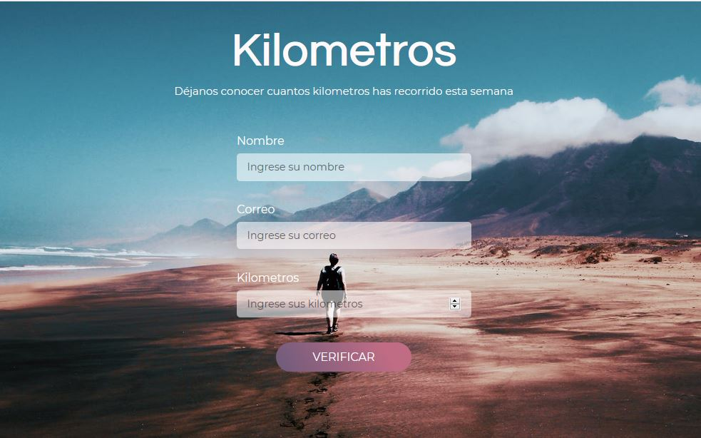

# Ejercicio 1 - Frontend



# React JS

## Cloning and Running the Application in local

Clone the project into local

Install all the npm packages. Go into the project folder and type the following command to install all npm packages

```bash
npm install
```

In order to run the application Type the following command

```bash
npm start
```

The Application Runs on **localhost:3000**

## Resources

**create-react-app** : The following link has all the commands that can be used with create-react-app
https://es.reactjs.org/docs/create-a-new-react-app.html

**ReactJS** : Refer to https://reactjs.org/ to understand the concepts of ReactJS

**React Hook Form** : Refer to https://react-hook-form.com/ to understand how to use the Forms
